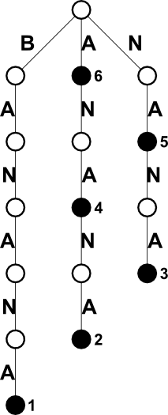

Árvores de Sufixos
==================

Árvores de sufixos são estruturas de dados que representam o conjunto 
`S(text)` de todas as
substrings de uma string `text` dada. A relação de pertinência (`s` 
pertence a `S(text)`?) é o mais básico problema associado a esta estrutura, e
uma "boa" árvore de sufixos tem três características fundamentais:

1. pode ser construída com tamanho linear;
1. pode ser construída em tempo linear;
1. pode responder questão de pertinência em complexidade linear em relação ao
tamanho de `s`.

Definições 
----------

Seja `G` um grafo acíclico direcionado, com raiz, cujas arestas `e` recebem,
como rótulos, caracateres ou palavras de um alfabeto `A` de tamanho constante.
Seja `label(e)` o rótulo de `e`. O rótulo de um caminho `p` é a concatenação
dos rótulos de todas as arestas do caminho.

Tal grafo representa um conjunto de strings definidas pelos rótulos 
de todos os caminhos possíveis em `G`. Defina

        Labels(G) = {label(p): p é caminho em G com início na raiz}

Diremos que `G` representa todas as substrings de `text` se `Labels(G) = S(text)`.

Um nó `n` cujo caminho da raiz até `n` tem como rótulo um sufixo de `text` é 
denominado **nó essencial**.

Tries
-----

**Trie de substrings**, ou simplesmente **trie**, é um grafo `G`, como acima 
definido, cujos rótulos consistem apenas de um único caractere. A figura abaixo
ilustra a trie da palavra "BANANA": os nós pretos são nós essenciais, e os
números ao lado dos nós essenciais são os índices do caractere inicial do
sufixo.

Observe que é possível usar esta trie para identificar se uma string `s` é ou
não substring de "BANANA", bastando proceder de forma semelhante à busca binária.
Para `s = "NAN"`, partindo da raiz, temos "N" na aresta à direita, "A" na única
aresta e "N" na aresta seguinte: logo `s` é substring. Como o nó de chegada é
branco, a substring não é sufixo. Para `s = "NAS"`, o último caractere ("S")
não seria encontrado; o mesmo para `s = "MAS"`, onde a falha acontece logo no
primeiro caractere. Para `s = "NANAN"`, a busca se encerraria por chegar em um
nó nulo. Observe que esta busca tem complexidada `O(|s|)`, 
atendendo um dos critérios de uma boa árvore de sufixos.

Porém os outros dois critérios não são satisfeitos: se a string inicial tem
`N` caracteres, a construção e o espaço em memória são `O(N^2)`.

Para reduzir o tamanho em memória da trie uma estratégia possível é compactar
as **cadeias**, onde uma **cadeia** é o maior caminho possível composto por
nós não-essenciais com grau de saída um (isto é, com uma única aresta partindo
do nó). Esta compactação resulta em uma _suffix tree_.

Suffix Tree
-----------

Conforme dito anteriormente, uma _suffix tree_ é a estrutura resultante da
compactação das cadeias de uma trie. A string resultante da compactação do
caminho `p` é descrita por uma par de índices `[i,j]`, de modo que 
`label(p) = text[i..j]`, sendo que pode haver mais de uma escolha possível para
tais índices.

A figura abaixo ilustra a _suffix tree_ associada a trie anterior.

Observe que agora, exceto a raiz, todos os nós são essenciais, de modo que o
armazenamento agora é proporcional ao número de suffixos, e como uma string
`s` tem `|s|` sufixos, o espaço em memória é linear em relação ao tamanho da
string, uma redução significativa em relação às tries.

### Referências

HALIM, Steve; HALIM, Felix. [Competitive Programming 3](http://cpbook.net/), Lulu, 2013.

CROCHEMORE, Maxime; RYTTER, Wojciech. [Jewels of Stringology: Text Algorithms](http://site.ebrary.com/lib/univbrasilia/reader.action?docID=10201155), WSPC, 2002.
